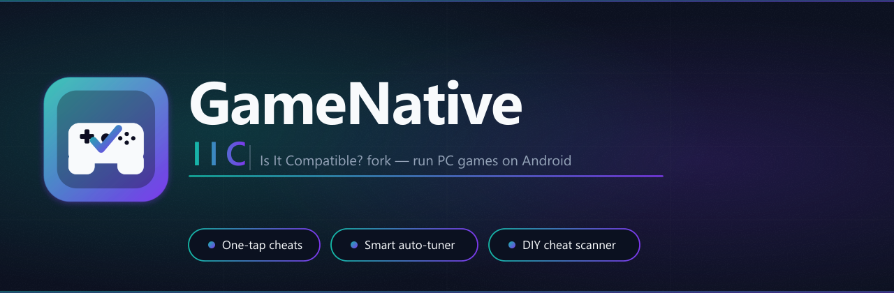

**Run PC games on Android — tuned, cheated, and sped up.** One-tap "make it work", a built-in
cheat engine, a universal speed hack, and crowd-sourced crash fixes.

[](https://github.com/mayusi/IsItCompatible-GameNative/releases/latest)

[](../../releases)
[](../../releases)
[](../../releases)
[](../../releases)

## 📥 Download & install

1. **[Download the latest APK](https://github.com/mayusi/IsItCompatible-GameNative/releases/latest)** — grab the file ending in `-arm64-v8a.apk` from the newest release.
2. On your Android handheld, open the APK. If prompted, allow **“Install unknown apps”** for your browser / file manager.
3. Tap **Install**. NovaGN installs **alongside** the official GameNative (separate app, won't touch it).
4. That's it. **From now on, NovaGN updates itself** — it checks this repo for new releases and offers a one-tap in-app update (Settings → *Check for updates* to check manually).

> Requires Android 9+ (a 64-bit ARM handheld). You only have to sideload once — after that the in-app updater handles every future version for you.

---

**NovaGN** is a premium fork of [GameNative](https://github.com/utkarshdalal/GameNative) by
utkarshdalal — rebuilt into its own thing with deep additions (a universal Wine-level speed
hack, a host-side cheat engine, a smarter auto-tuner, and more). It is packaged as
`app.gamenative.iic` so it **installs alongside** the official app without conflicting.

> **Note:** Because this fork is signed with a different key, Android treats it as a separate
> app. It cannot update an existing official GameNative installation in-place. Install it
> alongside; saves and container data are stored per-package.
>
> **NovaGN stands on GameNative's shoulders.** All of the upstream game-compatibility pipeline,
> cloud saves, and the original Android app are the work of utkarshdalal and the GameNative /
> Winlator projects. We credit them as the foundation everything here is built on.

---

## What is GameNative?

GameNative lets you run PC games from your Steam, Epic, and GOG libraries directly on
Android — no streaming required. It is built on top of the
[Winlator](https://github.com/brunodev85/winlator) Wine/Box64 stack, extended with cloud
saves, auto-applied game configs, and a native Android UI.

All core functionality, the upstream game-compatibility pipeline, cloud saves, and the Android
UI are the work of [utkarshdalal/GameNative](https://github.com/utkarshdalal/GameNative).
This fork adds the IIC-specific patches described below.

---

## IIC Fork Features

### One-Tap "Make It Work" Button

On the game-detail screen, a full-width **Make It Work** button runs the Compatibility Probe
auto-tuner end to end with one tap. It cycles through archetype configs, detects the first
one that boots the game successfully, and saves it — no manual config browsing required.

### One-Tap Cheats + DIY Scanner

A proxy-DLL cheat engine (`dinput8.dll`, injected into the game via Wine's DLL override
mechanism) powers two complementary cheat modes accessible from the **in-game QuickMenu →
Cheats tab**:

**Bundled cheat catalog** — 15 games have ready-made cheat tables (resources, health,
currency, etc.) with one-tap toggles and guided memory scans:

| Game | Cheats |
|---|---|
| Hollow Knight | Geo, Health, Soul |
| Stardew Valley | Gold |
| Hades | Health, Darkness, Gems, Diamonds, Titan Blood, Nectar, Chthonic Keys |
| Devil May Cry HD Collection | Infinite Vitality, Devil Trigger, Red Orbs (DMC3, multiple methods) |
| Skyrim Special Edition | Gold, Health |
| Terraria | Platinum, Health, Mana, Defense, Gold, Ammo |
| Cuphead | HP, Coins |
| Dead Cells | Gold, Cells, Health |
| Celeste | *(listed, no cheatable values in a one-hit-kill game)* |
| Undertale | Gold, HP |
| Vampire Survivors | Coins, HP, Run Gold |
| Slay the Spire | Gold, HP *(best-effort — JVM heap)* |
| Binding of Isaac: Rebirth | Coins, Keys, Bombs |
| Cult of the Lamb | Gold, Devotion, Health |
| Brotato | Materials, HP |

The catalog is **OTA-updatable**: new tables are deployed by committing
[`cheattables/registry.json`](cheattables/registry.json) — no app release needed.

Because Box64 does not produce stable addresses across runs, each table entry is a
**recipe** (scan → narrow → freeze), not a hardcoded address. Tables also support AOB
(array-of-bytes) patch cheats and pointer-chain freezes for games where a stable chain is
available (e.g. DMC3 one-tap HP/DT verified on device).

**DIY cheat scanner** — for games without a premade table, the Cheats tab exposes a
free-form value scanner: choose a type (i32 / f32), enter the current in-game value, scan,
change the value in-game, narrow, repeat until one candidate remains, then freeze.
Direction-based narrowing (increased/decreased/changed) is also supported for unknown
initial values.

**Cheats discoverability** — library cards display a gold lightning-bolt "Has Cheats"
badge for games that have a bundled table. The game-detail screen shows a dedicated cheats
section.

### Smart Auto-Tuner

The Auto-Tuner empirically sweeps Wine/graphics configs and measures real performance on
your device. It now includes:

- **Crash-fix-retry loop**: after a trial crashes or shows a black screen, the engine
  classifies the Wine log, looks up a fix from the catalog, applies it, and retries the
  same config slot — automatically, without user input.
- **Warm-start**: if this game was tuned before, the sweep seeds its starting config from
  the prior winning result so it converges faster.

**Seven optimization goals:**

| Goal | What it optimises |
|---|---|
| Compatibility Probe | "Does it even run?" — fast boot check (~5–8 min), ~6 archetype configs |
| Max FPS | Highest average frame rate |
| FPS + Stability | Best balance of frame rate and smoothness (good for online play) |
| FPS + Battery | Best FPS per watt — extends playtime (device must be unplugged) |
| FPS + Cool | Best FPS while keeping thermals low — good for long sessions |
| Low-End Friendly | Lightest stable config for modest hardware |
| Custom Weights | User-defined FPS / stability / battery / temperature weight sliders |

**Sweep mechanics:**

- Two measurement modes: **Auto** (hands-off, reads FPS session data) and **Manual** (user
  plays, taps "Stop Recording")
- Per-trial: warmup phase, measurement window, cooldown with GPU temp tracking
- Black-screen detection and crash detection — aborted trials are classified, not silently
  discarded
- Results screen shows all ranked configs with FPS, stability, battery, and temperature data
- Sweep can be canceled mid-run; the best result so far is preserved

### Crowd-Sourced Crash-Fix OTA Catalog

[`assets/crashfixes/registry.json`](app/src/main/assets/crashfixes/registry.json) maps
known crash signatures to fixes. The auto-tuner and the post-crash crash classifier both
pull from it. OTA-updatable by committing the JSON — no app release needed.

Current seed covers six failure classes:

| Failure Class | Auto-fix |
|---|---|
| `D3D12_UNSUPPORTED` | Force DX11 mode (covers UE4/UE5 + Lies of P, Remnant 2) |
| `STEAM_INIT_FAILED` | Bundled Steam API replacement |
| `WMV_CODEC` | Rename intro `.wmv` files to `.wmv.bak` |
| `STEAM_OVERLAY` | DLL override to disable overlay injection |
| `EOS_CRASH` | DLL override to disable Epic Online Services SDK |
| `D3D_COMPILER` | Native-first DLL override for `d3dcompiler_47` |

### Plain-English Crash Diagnosis

When a game exits abnormally, the fork:

1. Captures the Wine debug output in a ring buffer during the session.
2. Classifies the failure against known patterns.
3. Shows a human-readable snackbar message with a **one-tap fix action** where possible
   (e.g. "rename intro videos — tap to fix").
4. Optionally opens a "Why?" detail dialog with a plain-English explanation of what went
   wrong and what the fix does.

### Per-Game GameFixes Registry

A registry of compiled-in fixes covering Steam, GOG, and Epic games. Applied automatically
at launch when a matching game is detected.

**OTA updates:** The registry is also hosted at
[`gamefixes/registry.json`](gamefixes/registry.json) in this repo.
The app syncs this file in the background so new fixes can be deployed without a full app
update. Compiled-in fixes always take priority over OTA entries.

Covers 40+ games across Steam/GOG/Epic (shader-cache cleanup, DLL overrides, registry
keys, Wine env vars, and more).

### DeviceProfileDetector — 6 GPU Classes

On first launch, writes GPU-class-appropriate preference defaults once. Subsequent launches
leave user overrides intact.

| GPU Class | Chip Examples | Driver | VRAM |
|---|---|---|---|
| Adreno 830 / 8 Elite | AYN Odin 2 Pro, SD8 Elite phones | Turnip (Wrapper) | 4 GB |
| Adreno 750 / 8 Gen 3 | SD8 Gen 3 phones | Turnip (Wrapper) | 3 GB |
| Adreno 740 / 8 Gen 2 | SD8 Gen 2 phones | Turnip (Wrapper) | 2 GB |
| Adreno 6xx / 865–888 | SD865/888 phones | Wrapper (system GLES fallback) | 2 GB |
| Mali-G7xx / Dimensity | Dimensity 9000–9300 | System Vulkan | 2 GB |
| Mali lower / Helio | Helio-class | System Vulkan | 1 GB |

If no class matches, stock defaults remain unchanged.

### BestConfigService

On each game launch, fetches a GPU-matched recommended config from the upstream GameNative
API and applies it in a background thread — no UI block. Skipped when an intent already
supplied a config (e.g. Auto-Tuner result).

### Multi-Game Collection Support

For games that ship multiple titles in one install (one Steam/store ID, multiple
executables), the fork presents a "Games in this collection" picker instead of requiring
manual executable path changes.

Built-in collection: **Devil May Cry HD Collection** (Steam 631510) — DMC1, DMC2, DMC3:
Dante's Awakening. The crashing `dmcLauncher.exe` is excluded automatically.

Additional collections can be deployed via OTA (`assets/gamefixes/collections.json`).

### AYN Odin / Virtual Controller Support

Upstream GameNative expected controllers to declare physical input flags. Hardware
gamepads on AYN Odin (and similar Android handhelds) present as virtual input devices,
which upstream skipped. This fork accepts virtual-input devices as valid gamepads.

The `evshim` native shim now derives its shared-memory base path from the running package
name (`/proc/self/cmdline`) rather than a hardcoded path, so it works correctly under
`app.gamenative.iic`.

### Other Fixes

- **Controller button release-edge fix** — synthetic release edge flushed on re-attach to
  prevent sticky buttons
- **dxwrapper self-heal** — if a container's configured dxwrapper version is no longer
  present, the app auto-selects the newest available version
- **Force-internal-storage** — new containers default to internal storage to avoid FUSE
  latency and `SIGKILL` races on some devices
- **suspendPolicy auto** — new containers default to `auto` rather than `manual`, so the
  system handles foreground/background transitions without manual intervention
- **BOM-safe config parsing** — strips UTF-8 BOM before JSON/INI parsing; prevents silent
  parse failures from Windows-side tools
- **Ko-fi nag disabled** — the periodic Ko-fi prompt is suppressed. Please consider
  supporting the upstream project directly at [ko-fi.com/gamenative](https://ko-fi.com/gamenative)

---

## IIC Fork vs Vanilla GameNative

| Feature | Vanilla GameNative | This Fork (IIC) |
|---|---|---|
| Package ID | `app.gamenative` | `app.gamenative.iic` |
| Install alongside official | — | Yes (separate package) |
| One-Tap "Make It Work" | No | Yes (COMPAT_PROBE in one tap) |
| Auto-Tuner | No | Yes (7 goals, 2 modes, crash-fix-retry) |
| Crash classifier + "Why?" dialog | No | Yes (one-tap fixes, plain-English diagnosis) |
| Crowd-sourced crash-fix OTA | No | Yes (`crashfixes/registry.json`, 6 failure classes) |
| In-game cheat engine | No | Yes (proxy DLL + QuickMenu Cheats tab) |
| Bundled cheat catalog | No | Yes (15 games, OTA-updatable) |
| DIY memory scanner | No | Yes (scan → narrow → freeze, in-game) |
| Cheats badge on library cards | No | Yes (lightning bolt badge) |
| Per-game fixes | Upstream registry | 40+ compiled-in + OTA updates |
| Device GPU defaults | No | 6 GPU classes, one-shot |
| Best config on launch | Upstream API | Upstream API + auto-apply |
| Multi-game collections | No | DMC HD + OTA `collections.json` |
| AYN Odin controller | Partial | Full virtual-device support |
| IIC app session feedback | No | Yes (broadcast at session end) |

---

## Installation

This fork is distributed through the **Is It Compatible?** companion app. Alternatively,
download an APK from the [Releases](../../releases) page if available, or build from
source (see below).

1. Enable "Install from unknown sources" in Android settings.
2. Install the APK. It appears as a separate app alongside any existing GameNative install.
3. Log in to Steam (or Epic/GOG) and play.

---

## OTA Files

Four JSON files are hosted in this repo or bundled in-app and synced in the background:

| File | Contents | Sync |
|---|---|---|
| [`gamefixes/registry.json`](gamefixes/registry.json) | Per-game Wine/DLL fixes (env vars, registry keys, DLL overrides) | OTA from repo |
| [`cheattables/registry.json`](cheattables/registry.json) | Per-game cheat recipes (15 games, scan/freeze/patch) | OTA from repo |
| `assets/crashfixes/registry.json` | Crash-signature → fix-rung catalog (6 failure classes) | OTA from repo |
| `assets/gamefixes/collections.json` | Multi-game collection definitions | Bundled in-app |

Compiled-in entries always take priority over OTA entries — there is no regression for
games already covered at build time. A bad OTA entry is skipped defensively; the rest
load normally.

---

## Building from Source

Standard Android Studio project. Tested with AGP 8.x and NDK `27.3.13750724`.

```sh
# Optional: add a SteamGridDB API key for game artwork
echo "STEAMGRIDDB_API_KEY=your_key_here" >> local.properties

./gradlew assembleModernDebug
```

The `modern` flavor produces `app.gamenative.iic` (via `applicationIdSuffix = ".iic"`).
The `legacy` flavor produces `app.gamenative` (same ID as upstream — intended for older
Android builds, not the IIC fork).

> **Large asset note:** `app/src/legacy/assets/extras.tzst` (~82 MB) is excluded from
> this repository via `.gitignore` because it exceeds GitHub's per-file warning threshold.
> Copy it from an upstream checkout or Gradle cache into the expected path before building.

---

## License

Fork of GameNative, distributed under the same terms:
**[GNU General Public License v3.0](LICENSE)** — see the `LICENSE` file.

See [THIRD_PARTY_NOTICES](THIRD_PARTY_NOTICES) for attributions, copyleft source offers,
and notices about third-party and proprietary components bundled with the app (including
the Winlator/Wine lineage).

---

## Credits

- **GameNative** — original project by [utkarshdalal](https://github.com/utkarshdalal/GameNative).
  All core functionality, the upstream game-compatibility pipeline, cloud saves, and the
  Android UI are their work. This fork only adds the IIC-specific patches described above.
- **Winlator** — Wine-on-Android container runtime by
  [brunodev85](https://github.com/brunodev85/winlator), which GameNative builds upon.

---

**Disclaimer:** This software is for playing games you legally own. Do not use it for
piracy or any other unlawful purpose. The fork maintainer takes no responsibility for
misuse.
